# Django Translations <!-- .slide: class="center" -->
## for the next generation <!-- .slide: class="center" -->

---
 

 <!-- .slide: class="center" -->
Note: Hi, I'm katie
---
 

 <!-- .slide: class="center" -->
Note: and i've come to this reaisation recently,
---
# en_US <!-- .slide: class="center" -->
Note: I don't speak english

well, american
---
# en_AU <!-- .slide: class="center" -->
Note: I speak aussie
---
# en_AU != en_US <!-- .slide: class="center" -->
Note: Australian isn't the same as english

---
# colour <!-- .slide: class="center" -->
Note: this is how I spell colour
---
# centre <!-- .slide: class="center" -->
Note: this is centre

these make CSS really fun to try and code.
---
# localisation <!-- .slide: class="center" -->
Note: because it's an issue of locatalisation. I like being able to use applicationa and programs in my language.
---
 

 <!-- .slide: class="center" -->
---
 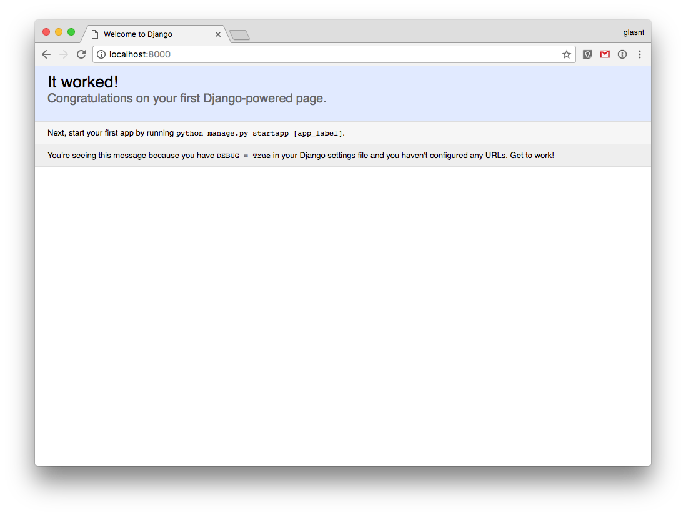
Note: this is the default django app
---
 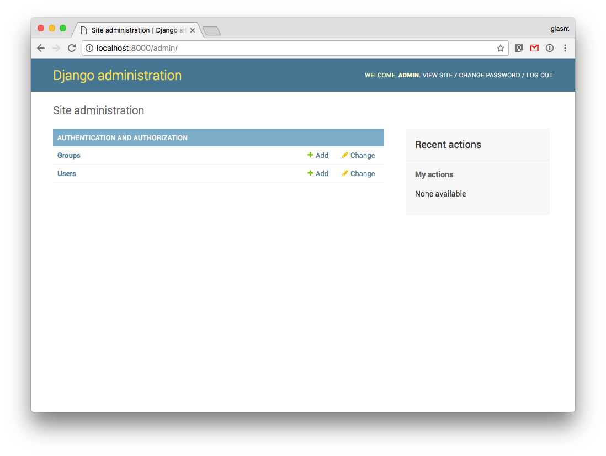
Note: it's great, if you speak american english
---
 

 <!-- .slide: class="center" -->
Note: but what about everyone else?
---
# en_US <!-- .slide: class="center" -->
Note: by default - american
---
# en_AU <!-- .slide: class="center" -->
Note: there's also some AU localations but it's not complete

---
 

 <!-- .slide: class="center" -->
Note: but then, I also speak another lanuage

so today, i'm releasing
---
## em_JI <!-- .slide: class="center" -->
Note: the em_JI localisation
---
 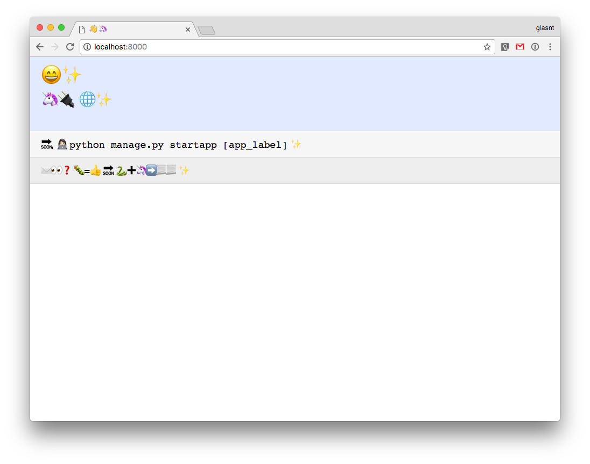
---
 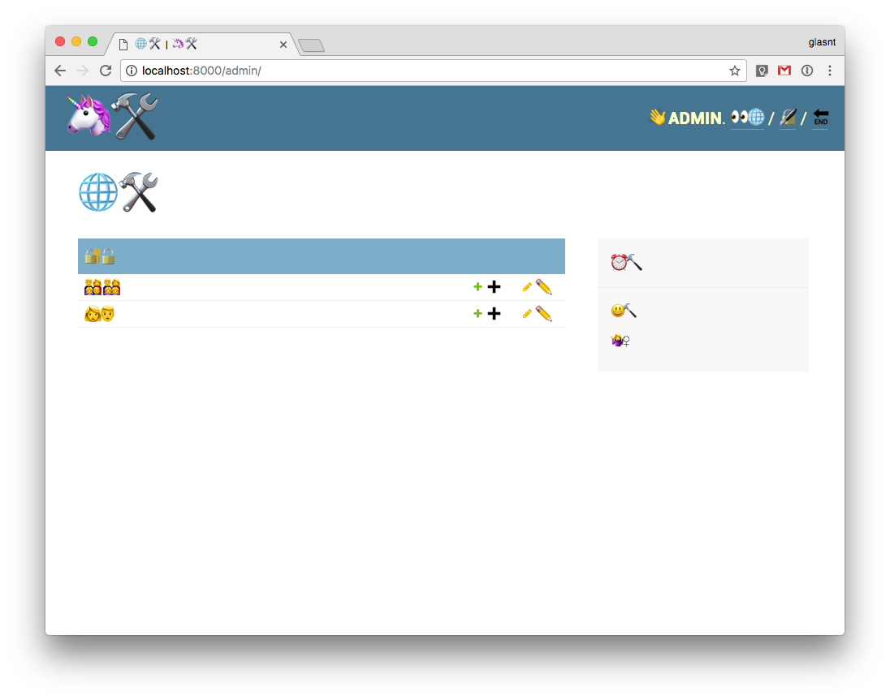
---
 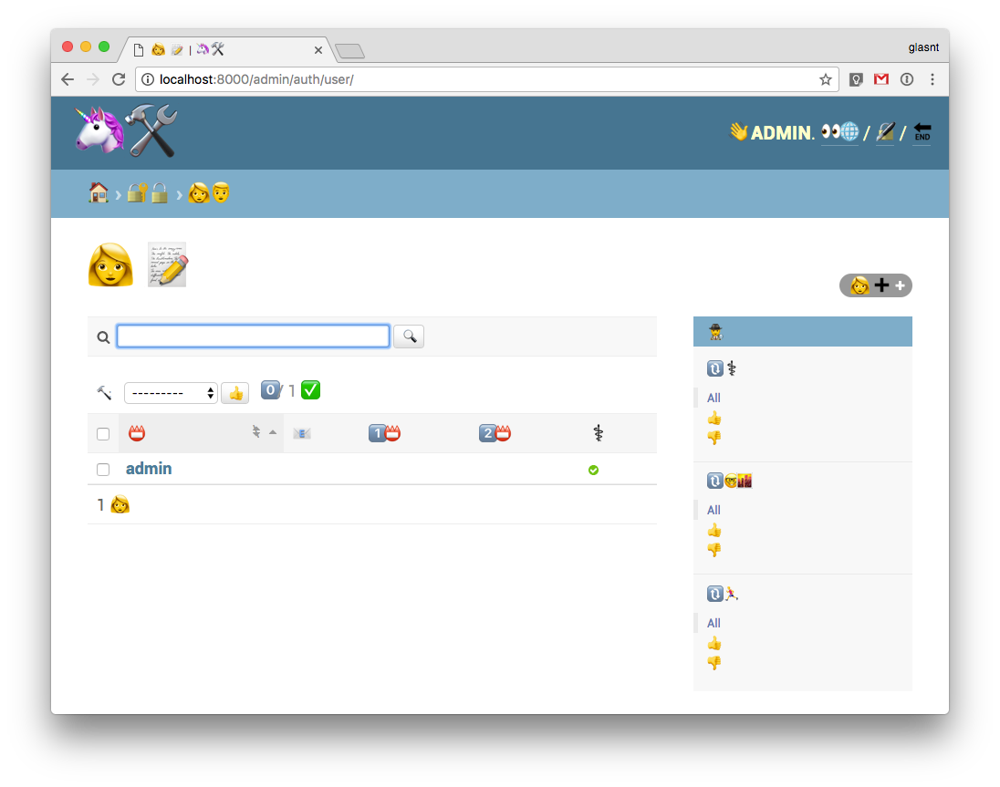
---
 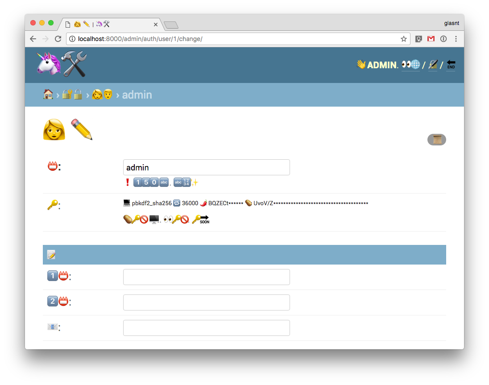
---
 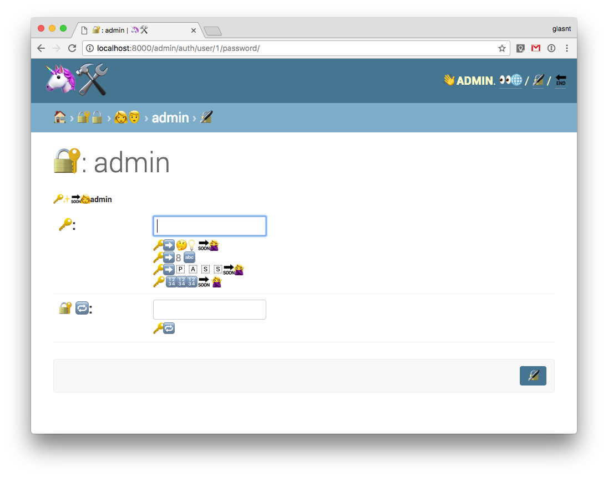
---
# 🔑➡️ 🤔💡 🔜🙅 <!-- .slide: class="center" -->
Note: Your password can't be too simliar to other personal information
---
# 🔑➡️8️⃣🔤 <!-- .slide: class="center" -->
Note: Your password must contain at least 8 characters
---
# 🔑➡️ 🇵 🇦 🇸 🇸🔜🙅 <!-- .slide: class="center" -->
Note: Your password can't be a commonly used password
---
#🔑 🔢🔢🔢 🔜 🙅 <!-- .slide: class="center" -->
Note: Your password can't be entirely numeric
---
 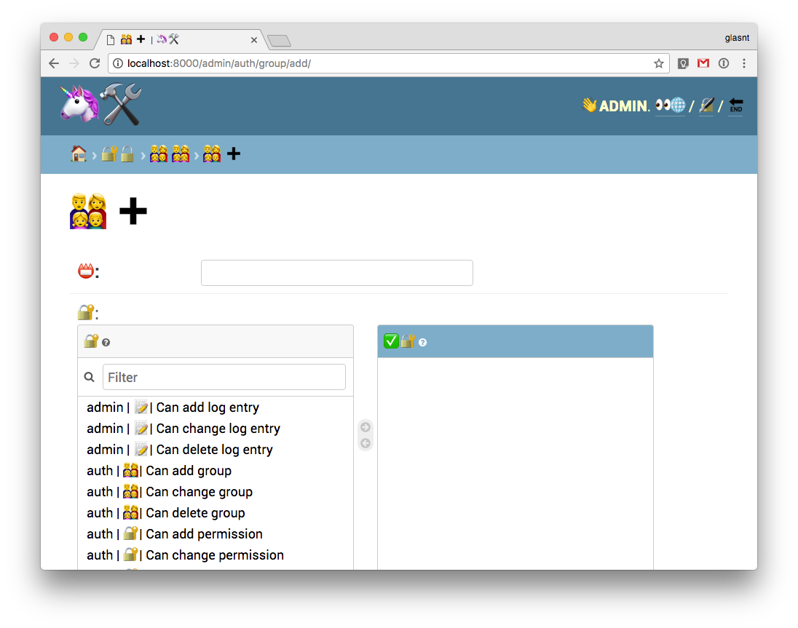
Note: Note the strings that can't be translated
---
 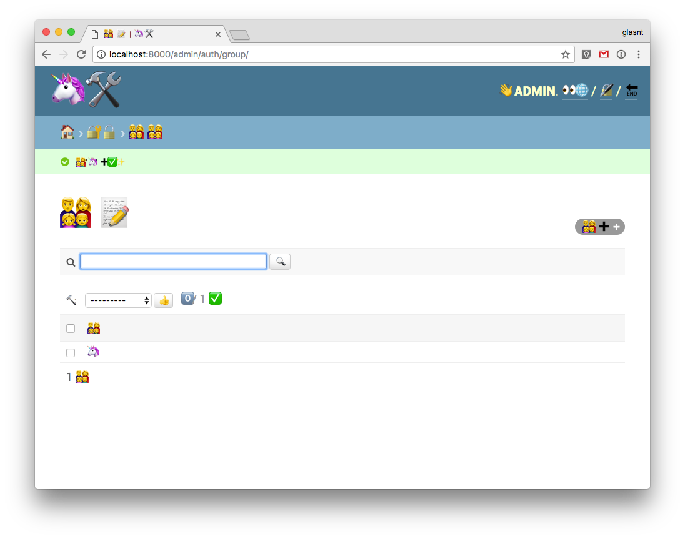
---
 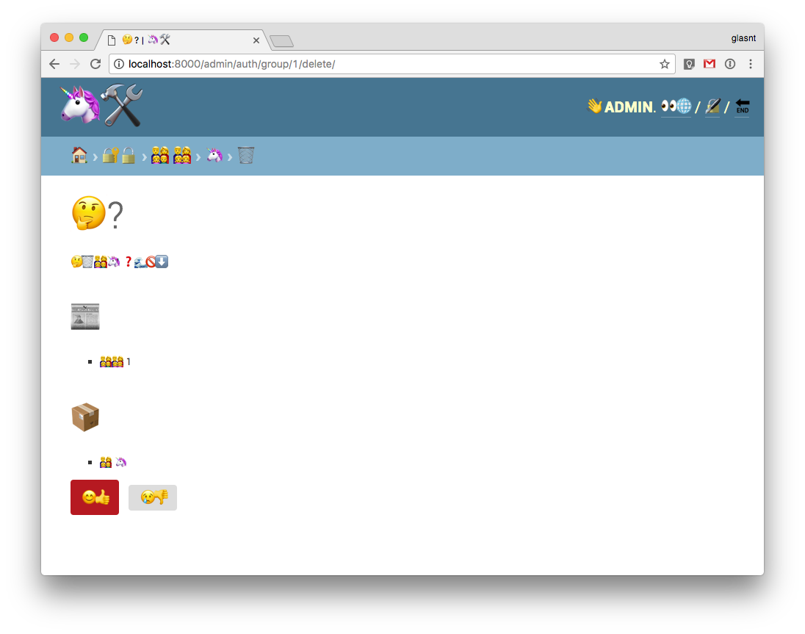
---
# em_JI <!-- .slide: class="center" -->
---
#### Complete django translations <!-- .slide: class="center" -->
### be, ca, cs, da, de, dsb
### el, en, eo, es, es_AR
### fi, fr, gd, he, hsb
### hu, id, it, ja, ko, lt
### nl, pl, pt_BR, ru, sl
### tr, uk, zh_CN
---
#### Need help <!-- .slide: class="center" -->
### nl_BE, et, en_AU, my <!-- .slide: class="center" -->
### lb, gl, ga, nb, zh_TW
### bg, sv, sk, ar, mn, pt
### ro, es_CO, eu, sq, ls
### & dozens more

---

# tlh <!-- .slide: class="center" -->

## Klingon <!-- .element: class="fragment" -->

---

 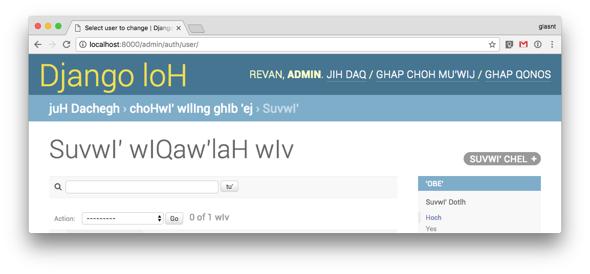
---

 

 <!-- .slide: class="center" -->
---
### docs.djangoproject.com/en/1.11/ <!-- .slide: class="center" -->
### internals/contributing/localizing/
Note: in all seriousness
---
  
  
  
  
  

#### glasnt.com/talks

Note: thank you for your time.